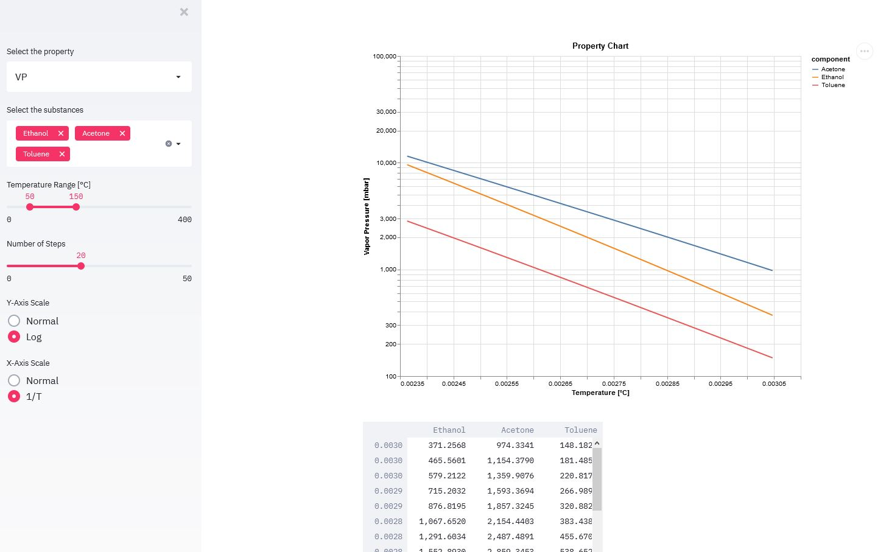
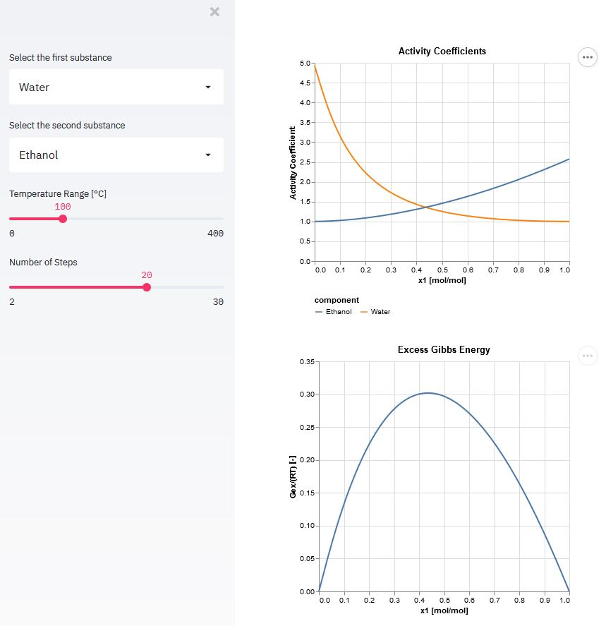
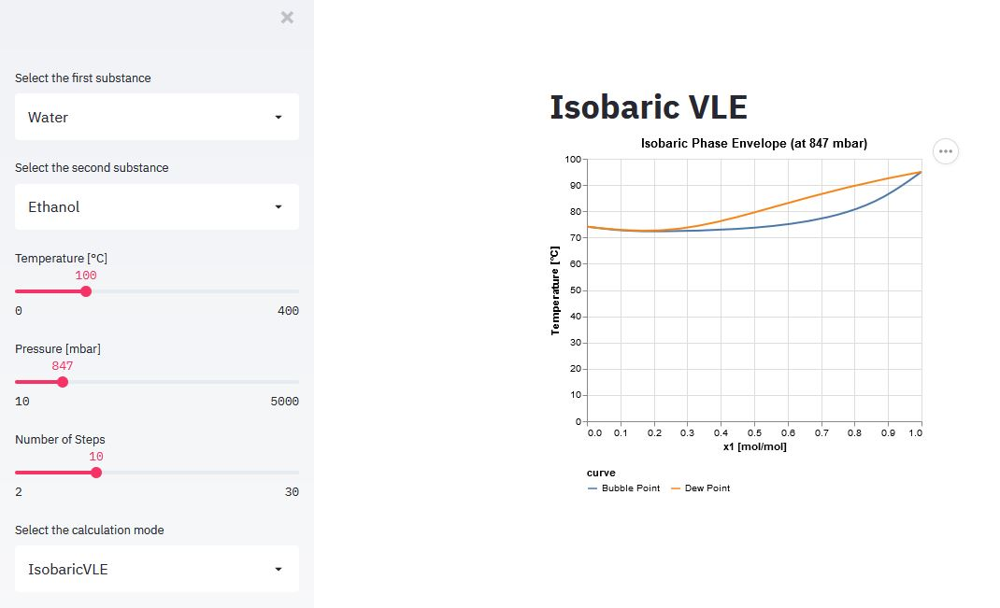

# Python Demonstration Apps for OpenIKCAPE

## Preface
These demo apps are created with Python using the [Streamlit](https://www.streamlit.io) library. Streamlit allows me to focus on implementing the process engineering features and still get nice looking prototype apps to test the calculations in an interactive manner.

## Pure Component Properties
The Pure Component Property app allows you to select a temperature-dependent physical property and a number of chemical substances. In addition you can specify the temperature range and the number of evaluation steps. As a gimmick, you can plot logarithmic vs 1/T plots for vapor pressure.

## Activity Coefficients
The Activity Coefficient Plot (in bsv.py) allows you to select a binary system and a temperature for which the activity coefficients of the entire composition range are calculated with the NRTL method.

## Binary Vapor/Liquid Equilibria

The Binary VLE Plot (in bsv.py) allows you to select a binary system and a temperature (or pressure for isobaric mode) for which the vapor/liquid equilibrium of the entire composition range is calculated with the NRTL method.

